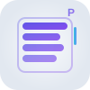

# Phaser List View - Logo Design

This repository contains the logo designs for the **phaser-list-view** JavaScript library.

## About the Project

Phaser List View is a high-performance scrollable list view and carousel library for the Phaser game framework. It provides iOS-like scrolling behavior with momentum, bouncing, and snapping effects.

## Logo Variations

### 1. Main Logo (`logo.svg`)
- **Dimensions**: 400x120px
- **Features**: Animated list items with scrolling effects
- **Use case**: Primary logo for documentation, websites, and presentations
- **Background**: Works best on light backgrounds


### 2. Simple Logo (`logo-simple.svg`)
- **Dimensions**: 300x80px  
- **Features**: Clean, static design without animations
- **Use case**: GitHub README, npm package, general documentation
- **Background**: Works on light backgrounds


### 3. Icon Version (`logo-icon.svg`)
- **Dimensions**: 100x100px (square)
- **Features**: Compact icon with subtle "P" for Phaser
- **Use case**: Favicons, app icons, small UI elements
- **Background**: Light background with subtle gradient



### 4. Dark Version (`logo-dark.svg`)
- **Dimensions**: 300x80px
- **Features**: Optimized colors for dark backgrounds
- **Use case**: Dark mode interfaces, dark presentations
- **Background**: Dark backgrounds


## Design Elements

### Visual Concepts
- **List Items**: Horizontal bars representing scrollable list items
- **Scroll Indicator**: Vertical bar showing scroll position
- **Motion Lines**: Subtle lines indicating movement/scrolling
- **Typography**: Modern, clean fonts distinguishing "phaser" and "list-view"

### Color Palette
- **Primary**: Indigo to Purple gradient (#4F46E5 → #7C3AED)
- **Accent**: Cyan to Blue gradient (#06B6D4 → #3B82F6)
- **Text**: Dark gray (#374151) for secondary text
- **Light versions**: Lighter variants for dark backgrounds

### Animations (Main Logo)
- List items fade in sequence to simulate scrolling
- Scroll indicator moves up and down
- Motion lines appear and fade to show movement

## Usage Guidelines

### File Formats
- All logos are provided in SVG format for scalability
- SVG files can be easily converted to PNG, JPG, or other formats as needed
- Vector format ensures crisp display at any size

### Recommended Uses
- **Main Logo**: Hero sections, documentation headers, presentations
- **Simple Logo**: GitHub README, npm package page, general branding
- **Icon**: Favicons, mobile app icons, small UI elements
- **Dark Version**: Dark mode interfaces, dark presentations

### Technical Specifications
- All logos use web-safe fonts (Arial fallback)
- Gradients are defined for consistent color reproduction
- Optimized for both web and print use
- Accessible color contrast ratios

## Implementation

### HTML Usage
```html
<!-- Inline SVG -->


<!-- As background -->
<div style="background-image: url('logo-simple.svg'); background-size: contain;"></div>
```

### CSS Usage
```css
.logo {
  background-image: url('logo-simple.svg');
  background-repeat: no-repeat;
  background-size: contain;
  width: 300px;
  height: 80px;
}
```

### Markdown Usage
```markdown

```

## License

These logo designs are created for the phaser-list-view project and follow the same license as the main project.

---

**Created for**: [phaser-list-view](https://github.com/mattcolman/phaser-list-view)  
**Author**: Matt Colman  
**Library**: High-performance scrollable lists and carousels for Phaser